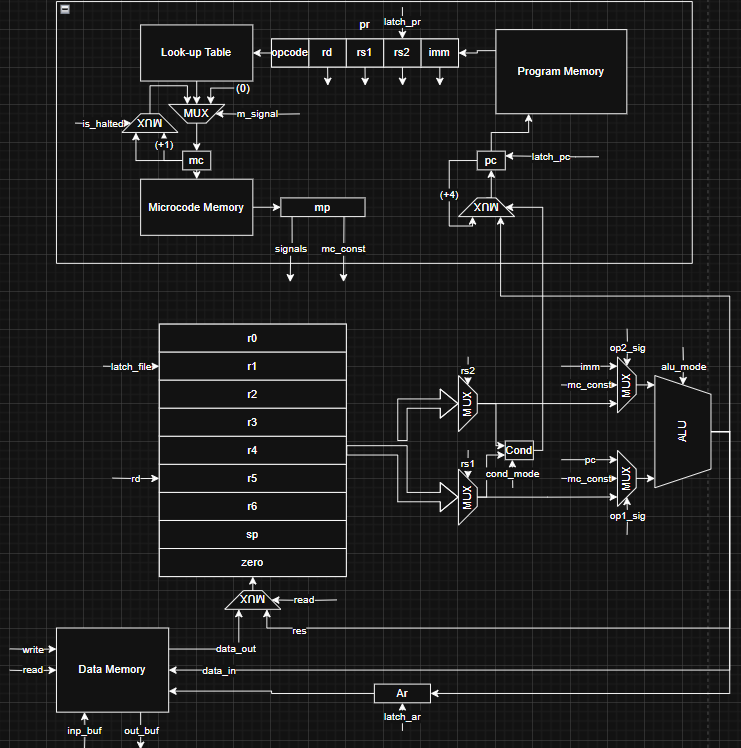

# Рисковая машинка)
- Трикашный Михаил Дмитриевич P3206
- Вариант: `asm | risc | harv | mc | tick | binary | stream | mem | cstr | prob1 | vector`
- Расшифровка:
  - `asm`: синтаксис ассемблера. Необходима поддержка `label`-ов, секций и директивы `.org`. Поддержка пользовательских макроопределений. 
  - `risc`: система команд должна быть упрощенной, в духе RISC архитектур
    -  Стандартизированная длина команд.
    -  Операции над данными осуществляются только в рамках регистров.
    -  Доступ к памяти и ввод-вывод -- отдельные операции
  - `harv`: Гарвардская архитектура
  - `mc`: команды реализованы с помощью микрокоманд
  - `tick`: процессор необходимо моделировать с точностью до такта, процесс моделирования может быть приостановлен на любом такте.
  - `binary`: бинарное представление машинного кода
  - `stream`: Ввод-вывод осуществляется как поток токенов.
  - `mem`: порты ввода-вывода отображаются в память и доступ к ним осуществляется штатными командами
  - `cstr`: Null-terminated (C string)
  - `prob1`: Euler problem 4 [link](https://projecteuler.net/problem=4)
  - `vector`: векторная организация процессора (понятие не имею что бы это значило)

# Язык программирования `asm`

```text
<программа> ::= { <строка> }
<строка> ::= <директива> | <метка> [ <инструкция> | <содержимое_данных> ] | <инструкция> | <определение_макроса> | <комментарий>
<директива> ::= "." <идентификатор> [ <аргумент> ] 
<идентификатор> ::= <буква> { <буква> | <цифра> | "_" } 
<аргумент> ::= <число> | <строка> | <имя_метки>
<метка> ::= <имя_метки> ":" 
<имя_метки> ::= <идентификатор> 
<инструкция> ::= <опкод> [ <операнд> { "," <операнд> } ]
<опкод> ::= "lui" | "jal" | "mv" | "sw" | "lw" | "addi" | "add" | "sub" | "mul" | "mulh" | "div" | "rem" | "sll" | "srl" | "sra" | "and" | "or" | "xor" | "j" | "jr" | "bgt" | "bgtu" | "ble" | "bleu" | "beq" | "bne" | "halt" 
<операнд> ::= <регистр> | <число> | <имя_метки> | <подстановка_макроса> | <ссылка_на_память> 
<регистр> ::= "zero" | "r0" | "r1" | "r2" | "r3" | "r4" | "r5" | "r6" | "sp" 
<число> ::= [ "-" ] <десятичное> | "0x" <шестнадцатеричное> | "0b" <двоичное> 
<десятичное> ::= <цифра> { <цифра> } 
<шестнадцатеричное> ::= <шестн_цифра> { <шестн_цифра> } 
<двоичное> ::= <двоичн_цифра> { <двоичн_цифра> } 
<цифра> ::= "0" | "1" | "2" | "3" | "4" | "5" | "6" | "7" | "8" | "9" 
<шестн_цифра> ::= <цифра> | "a" | "b" | "c" | "d" | "e" | "f" | "A" | "B" | "C" | "D" | "E" | "F" 
<двоичн_цифра> ::= "0" | "1" 
<ссылка_на_память> ::= <число> "(" <регистр> ")" 
<подстановка_макроса> ::= "%hi(" <имя_метки> ")" | "%hi(" <число> ")" | "%lo(" <имя_метки> ")" | "%lo(" <число> ")" 
<определение_макроса> ::= ".macros" <идентификатор> <аргумент> 
<содержимое_данных> ::= ".byte" <аргумент_данных> { "," <аргумент_данных> } | ".word" <аргумент_данных> { "," <аргумент_данных> } 
<аргумент_данных> ::= <число> | <строка> 
<строка> ::= "'" { <символ> } "'" 
<символ> ::= <любой_символ_кроме_кавычки_и_запятой> | <экранированная_последовательность> 
<экранированная_последовательность> ::= "" ( "n" | "t" | """ | "" ) 
<комментарий> ::= ";" { <любой_символ_кроме_перевода_строки> }  
<любой_символ_кроме_кавычки_и_запятой> ::= <любой_символ_кроме> ["'" | ","] 
<любой_символ_кроме_перевода_строки> ::= <любой_символ_кроме> "\n" 
<любой_символ_кроме> ::= <любой_печатный_символ_кроме_указанного>
```
- Пояснения к синтаксису:
  - `<программа>`: Последовательность строк, каждая из которых может быть директивой, меткой, инструкцией, определением макроса, комментарием или пустой строкой.
  - `<директива>`: Начинается с точки (например, `.data`, `.text`, `.org`, `.macros`). Директивы `.org` и `.macros` принимают один аргумент; `.data` и `.text` — нет.
  - `<метка>`: Идентификатор с двоеточием, за которым может следовать инструкция или данные на той же строке.
  - `<инструкция>`: Опкод и ноль или более операндов, разделённых запятыми или пробелами.
  - `<операнд>`: Может быть регистром, числом, меткой, подстановкой макроса (`%hi` или `%lo`) или ссылкой на память (например, `4(r0)`).
  - `<содержимое_данных>`: Используется в секции .data с директивами .byte или .word, принимает числа или строки.
  - `<строка>`: Заключена в одинарные кавычки, поддерживает экранированные последовательности (например, `\n`).
  - `<комментарий>`: Начинается с `;` и продолжается до конца строки.
  - `<определение_макроса>`: Определяет макрос с помощью `.macros`, принимает идентификатор и значение.
  - Директива `.org` работает только в секции `.data`
- Стратегия вычислений:
  - Модель выполнения: Программа выполняется последовательно, начиная с инструкции по адресу `0x0`, которая является инструкцией `j` к метке `_start`. Инструкции считываются, декодируются и выполняются в памяти программ, каждая занимает ровно 4 байта.
  - Управление потоком:
    - Линейное выполнение, если не изменено инструкциями ветвления (`bgt`, `bgtu`, `ble`, `bleu`, `beq`, `bne`), перехода (`j`, `jal`, `jr`) или остановки (`halt`).
    - Инструкции ветвления и перехода используют относительную адресацию (`pc + k`), кроме `jr`, которая использует абсолютный адрес из регистра.
  - Доступ к памяти:
    - Память данных доступна через инструкции `lw` (чтение слова) и `sw` (запись слова), поддерживающие прямую (`0x80(zero)`) и относительную адресацию (`4(r0)`).
    - Память программ доступна только для чтения.
  - Обработка инструкций:
    - Инструкции работают с регистрами (`r0–r6`, `sp`, `zero`) или непосредственными значениями.
    - Арифметические и логические операции (`add`, `sub`, `mul` и т.д.) выполняются только над регистрами (искл. `addi`).
    - Непосредственные значения — 16-битные, с расширением знака для `addi` или нулей для `lui`.
    - Начало выполнения: Программа стартует с метки `_start` в секции `.text`, первая инструкция находится по адресу `0x4` (поскольку `0x0` содержит переход к `_start`).
    - Завершение: Инструкция `halt` останавливает выполнение.

- Области видимости:
  - Метки:
    - Глобальная видимость: 
      - Метки, определённые в `.data` и `.text`, видны по всей программе.
    - Разделение по секциям: 
      - Метки в `.data` указывают на адреса в памяти данных; метки в `.text` — на адреса в памяти программ.
    - Подстановка меток:
      - В `.text` метка заменяется на (`адрес_метки - текущий_адрес - 4`) для относительной адресации в ветвлениях и переходах.
      - В `.data` метка заменяется на её абсолютный адрес.
    - Метки должны быть уникальны.
  - Макросы:
    - Глобальная видимость: 
      - Определяются с помощью `.macros` до секций `.data` или `.text`, видны по всей программе.
    - Текстовое замещение: 
      - Заменяются на своё значение во время второго прохода.
  - Регистры:
    - Глобальная видимость: 
      - Регистры (`zero`, `r0–r6`, `sp`) доступны по всей программе и являются общими.
    - Отсутствие локальной области: 
      - Нет понятия локальных переменных или стековых фреймов (`sp` звучит круто, но по факту это просто регистр общего назначения).
- Типизация:
  - Типы данных:
    - 32-битные целые числа: 
      - Все данные в регистрах и памяти — 32-битные целые (знаковые или нет, в зависимости от инструкции, например, `bgt` и `bgtu`).
    - Байты: 
      - В секции `.data` директива `.byte` хранит 8-битные значения; `.word` — 32-битные.
    - Строки: 
      - В `.data` строки — это последовательности ASCII-символов, хранятся как байты (`.byte`) или слова (`.word`), с возможным нулевым завершением.
    - Литералы:
      - Числовые литералы:
        - Десятичные: 42, -10.
        - Шестнадцатеричные: 0x1A, 0xFFFF.
        - Двоичные: 0b1010.
        - Использование: Применяются как непосредственные значения в инструкциях (например, `addi r0, r0, 42`) или в определениях данных (например, `.word 0x1A`).
      - Строковые литералы:
        - Формат: Заключены в одинарные кавычки (например, 'hello').
        - Экранированные последовательности: Поддерживаются `\n`, `\t`, `\"`, `\\`.
        - Хранение:
          - .byte: Каждый символ хранится как 1-байтное ASCII-значение (например, 'hello' → [ASCII_коды]).
          - .word: Каждый символ хранится как 4-байтное слово с нулевым заполнением (например, 'hello' → [ASCII_код, 0, 0, 0, ...]).
      - Литералы меток:
        - Формат: Идентификатор (например, цикл, данные).
        - Подстановка: Заменяются на адрес метки во время ассемблирования (относительный в `.text`, абсолютный в `.data`).
        - Подстановки макросов:
          - Формат: `%hi(метка | число)` (старшие 16 бит адреса метки или числа), `%lo(метка | число)` (младшие 16 бит адреса метки или числа).
          - Подстановка: `%hi` - (`num` >> 16 + 1) если `%lo` < 0, иначе (`num >> 16`).

# Организация памяти
  - Гарвардская архитектура.
  - Размер машинного слова:
    - в памяти данных 32 бита
    - в памяти инструкций 32 бита
  - Линейное адресное пространство
  - Для работы с памятью данных используются команды `sw` и `lw` (используется как прямая, так и относительная адресации)
  - Для переходов в памяти инструкций (кроме `jr`, там используется прямая адресация) используется относительная адресация (относительно `pc`)
```text
       Program memory
+------------------------------+
| 00 : jump n                  |  ; Прыжок к инструкции под меткой _start
|   ...                        |
|  n : _start: instruction1    |
|   ...                        |
+------------------------------+

            Data memory
+------------------------------+
| 0x00 : const1 (.word 42)     |  ; Статическая константа
| 0x04 : str (.byte 'hello',0) |  ; C-строка
| ...                          |
| l+0  : literal (.word 100)   |  ; Литерал
| l+4  : literal (.word 200)   |
| ...                          |
| 0x80 : input port            |  ; Порт ввода (MMIO)
| 0x84 : output port           |  ; Порт вывода (MMIO)
+------------------------------+
```
# Набор инструкций

Размер инструкции: 4 байта. `sw, lw, jal` выполняются за 4 такта, все остальные за 3.

- **Load Upper Immediate**
    - **Синтаксис:** `lui <rd>, <k>`
    - **Описание:** Загружает прямое значение сдвинутое влево на 16 бит в регистр.
    - **Операция:** `rd <- k << 16`

- **Move**
    - **Синтаксис:** `mv <rd>, <rs>`
    - **Описание:** Копирует значение из одного регистра в другой
    - **Операция:** `rd <- rs`

- **Store Word**
    - **Синтаксис:** `sw <rs2>, <offset>(<rs1>)`
    - **Описание:** Сохраняет 4х байтовое слово по адресу + сдвигу
    - **Операция:** `M[offset + rs1] <- rs2`

- **Load Word**
    - **Синтаксис:** `lw <rd>, <offset>(<rs1>)`
    - **Описание:** Загружает слово из памяти по адресу + сдвиг в регистр
    - **Операция:** `rd <- M[offset + rs1]`

- **Add Immediate**
    - **Синтаксис:** `addi <rd>, <rs1>, <k>`
    - **Описание:** Прибавляет 16 бит расширяя до знакового.
    - **Операция:** `rd <- rs1 + k`

- **Add**
    - **Синтаксис:** `add <rd>, <rs1>, <rs2>`
    - **Описание:** Складывает два числа
    - **Операция:** `rd <- rs1 + rs2`

- **Subtract**
    - **Синтаксис:** `sub <rd>, <rs1>, <rs2>`
    - **Описание:** Вычитает два числа
    - **Операция:** `rd <- rs1 - rs2`

- **Multiply**
    - **Синтаксис:** `mul <rd>, <rs1>, <rs2>`
    - **Описание:** Перемножает два числа и сохраняет младшие 32 бита результата
    - **Операция:** `rd <- rs1 * rs2`

- **Multiply High**
    - **Синтаксис:** `mulh <rd>, <rs1>, <rs2>`
    - **Описание:** Перемножает два числа и сохраняет старшие 32 бита результата
    - **Операция:** `rd <- (rs1 * rs2) >> 32`

- **Divide**
    - **Синтаксис:** `div <rd>, <rs1>, <rs2>`
    - **Описание:** Делит два числа
    - **Операция:** `rd <- rs1 / rs2`

- **Remainder**
    - **Синтаксис:** `rem <rd>, <rs1>, <rs2>`
    - **Описание:** Сохраняет остаток от деления двух чисел
    - **Операция:** `rd <- rs1 % rs2`

- **Logical Shift Left**
    - **Синтаксис:** `sll <rd>, <rs1>, <rs2>`
    - **Описание:** Логически сдвигает влево
    - **Операция:** `rd <- rs1 << rs2`

- **Logical Shift Right**
    - **Синтаксис:** `srl <rd>, <rs1>, <rs2>`
    - **Описание:** Логически сдвигает вправо
    - **Операция:** `rd <- rs1 >> rs2`

- **Arithmetic Shift Right**
    - **Синтаксис:** `sra <rd>, <rs1>, <rs2>`
    - **Описание:** Логически сдвигает вправо
    - **Операция:** `rd <- rs1 >> rs2`

- **Bitwise AND**
    - **Синтаксис:** `and <rd>, <rs1>, <rs2>`
    - **Описание:** Применяет логическое И для каждого бита обоих чисел
    - **Операция:** `rd <- rs1 & rs2`

- **Bitwise OR**
    - **Синтаксис:** `or <rd>, <rs1>, <rs2>`
    - **Описание:** Применяет логическое ИЛИ для каждого бита обоих чисел
    - **Операция:** `rd <- rs1 | rs2`

- **Bitwise XOR**
    - **Синтаксис:** `xor <rd>, <rs1>, <rs2>`
    - **Описание:** Применяет логическое ИСКЛ-ИЛИ для каждого бита обоих чисел
    - **Операция:** `rd <- rs1 ^ rs2`

- **Jump**
    - **Синтаксис:** `j <k>`
    - **Описание:** Переход к вычисленному значению `pc + k` 
    - **Операция:** `pc <- pc + k`

- **Jump and Link**
    - **Синтаксис:** `jal <rd>, <k>`
    - **Описание:** Записывает pc + 4 в регистр после чего действует аналогично `j`
    - **Операция:** `rd <- pc + 4, pc <- pc + k`

- **Jump Register**
    - **Синтаксис:** `jr <rs>`
    - **Описание:** Записывает в `pc` значение из регистра.
    - **Операция:** `pc <- rs`

- **Branch if Greater Than**
    - **Синтаксис:** `bgt <rs1>, <rs2>, <k>`
    - **Описание:** Перейти если больше
    - **Операция:** `if rs1 > rs2 then pc <- pc + k`

- **Branch if Greater Than (unsigned)**
    - **Синтаксис:** `bgtu <rs1>, <rs2>, <k>`
    - **Описание:** Перейти если больше или равно
    - **Операция:** `if rs1 > rs2 then pc <- pc + k`

- **Branch if Less Than or Equal**
    - **Синтаксис:** `ble <rs1>, <rs2>, <k>`
    - **Описание:** Перейти если меньше или равно
    - **Операция:** `if rs1 <= rs2 then pc <- pc + k`

- **Branch if Less Than or Equal (unsigned)**
    - **Синтаксис:** `bleu <rs1>, <rs2>, <k>`
    - **Описание:** Перейти если меньше
    - **Операция:** `if rs1 <= rs2 then pc <- pc + k`

- **Branch if Equal**
    - **Синтаксис:** `beq <rs1>, <rs2>, <k>`
    - **Описание:** переход если равно
    - **Операция:** `if rs1 == rs2 then pc <- pc + k`

- **Branch if Not Equal**
    - **Синтаксис:** `bne <rs1>, <rs2>, <k>`
    - **Описание:** Переход если не равно
    - **Операция:** `if rs1 != rs2 then pc <- pc + k`

- **Halt**
    - **Синтаксис:** `halt`
    - **Описание:** Останавливает машину

# Кодирование инструкций
```text
┌─────────┬───────┬─────────┬─────────┬───────────────────────────────┐
│ 31...27 │26...24│ 23...20 │ 19...16 │ 15                          0 │
├─────────┼───────┼─────────┼─────────┼───────────────────────────────┤
│ opcode  │  rd   │   rs1   │   rs2   │          imm value            │
└─────────┴───────┴─────────┴─────────┴───────────────────────────────┘
```
Опкоды операций:
- `00000` (0x00) - `lui`
- `00001` (0x01) - `mv`
- `00010` (0x02) - `sw`
- `00011` (0x03) - `lw`
- `00100` (0x04) - `addi`
- `00101` (0x05) - `add`
- `00110` (0x06) - `sub`
- `00111` (0x07) - `mul`
- `01000` (0x08) - `mulh`
- `01001` (0x09) - `div`
- `01010` (0x0a) - `rem`
- `01011` (0x0b) - `sll`
- `01100` (0x0c) - `srl`
- `01101` (0x0d) - `and`
- `01110` (0x0e) - `or`
- `01111` (0x0f) - `xor`
- `10000` (0x10) - `j`
- `10001` (0x11) - `jal`
- `10010` (0x12) - `jr`
- `10011` (0x13) - `ble`
- `10100` (0x14) - `bleu`
- `10101` (0x15) - `bgt`
- `10110` (0x16) - `bgtu`
- `10111` (0x17) - `beq`
- `11000` (0x18) - `bne`
- `11001` (0x19) - `halt`
- `11010` (0x1A) - `sra`

Коды регистров:
- `0000` (0x0) - `sp`
- `0001` (0x1) - `r0`
- `0010` (0x2) - `r1`
- `0011` (0x3) - `r2`
- `0100` (0x4) - `r3`
- `0101` (0x5) - `r4`
- `0110` (0x6) - `r5`
- `0111` (0x7) - `r6`
- `1000` (0x8) - `zero`

# Регистры
Все регистры 32х битные
Доступные программисту:
`Zero` `r0` `r1` `r2` `r3` `r4` `r5` `r6` `Sp`
Недоступные программисту: `Ar` `Pc` `Mc` `Mr` `Pr`
- `Zero` - всегда возвращает 0, read-only
- `r0` - `r6` - регистры общего назначения
- `Sp` - регистр общего назначения, но по лору это stack pointer
- `Ar` - регистр, хранящий в себе адрес памяти данных
- `Pc` - регистр, хранящий в себе адрес памяти инструкций
- `Mc` - регистр, хранящий в себе адрес памяти микрокоманд
- `Mr` - регистр, хранящий в себе микрокоманду, по адресу в `Mc`
- `Pr` - регистр, хранящий в себе инструкцию для выполнения

# Транслятор
```text
"Использование: python translator.py <input.asm> <code.bin> <data.bin>"
```
Работает в четыре прогона (да, я не умею писать трансляторы), за первый прогон собираются метки и формируется дамп данных, за второй прогон подставляются метки, за третий прогон подставляются макросы `%hi` и `%lo`, за четвертый формируется машинный код.
Вообще все это дело держится на честном слове (на меня сильно ругался линтер), поэтому с ним осторожнее.

# Модель процессора

```text
Использование: python machine.py <program_dump> <data_dump> <input_file> <input_fmt> (num | str)
```


# Микрокоманды
Одна микрокоманда состоит из 25 бит (20 бит под сигналы и 5 бит под mc_const)
- 24ый бит: `is_halted` - если 1 машина останавливается
- [23:22] биты: `m_signal` - управляет мультиплексором на входе `mc`.
  - `00` - выбирает `mc + 1` или `mc` (зависит от `is_halted`)
  - `01` - выбирает значение из LUT
  - `10` - выбирает `0` (используется для начала обработки следующей инструкции)
- 21ой бит: `latch_pr` - защелкивает `pr`
- 20ый бит: `latch_pc` - защелкивает `pc` 
- 19ый бит: `latch_file` - при его активации защелкивается значение с мультиплексора файла на входе в регистр `rd`
- 18ый бит: `latch_ar` - защелкивает `ar`
- 17ый бит: `write` - при активации записывает в Data Memory по адресу в `ar` данные с входной шины
- 16ый бит: `read` - при активации считывает данные из Data Memory по адресу в `ar`
- [15:14] биты: `op1_sig` - управляет выбором первого операнда для АЛУ
  - `00` - выбирает один из регистров
  - `01` - выбирает `mc_const`
  - `10` - выбирает `pc`
  - `11` - выбирает `imm`
- [13:12] биты: `op2_sig` - управляет выбором второго операнда для АЛУ
  - `00` - выбирает один из регистров
  - `01` - выбирает `mc_const`
  - `10` - выбирает `pc`
  - `11` - выбирает `imm`
- [11:9] биты: `cond_mode` - управляет режимом работы Cond Module (см документацию)
- [8:5] биты: `alu_mode` - управляет режимом работы ALU (см документацию)
- [4:0] биты: `mc_const`


# АЛУ
Поговорим об АЛУ. В моей модели оно довольно "жирненькое". Режимы АЛУ:
- `0000`: `Сложение` - складывает два числа с шины первого аргумента и второго аргумента и выводит результат на шину результата.
- `0001`: `Вычитание` - вычитает число с шины второго аргумента из числа с шины первого аргумента и выводит результат на шину результата.
- `0010`: `Умножение (младшие 4 байте)` - перемножает числа с шин аргументов и выводит младшие 4 байта на шину результата.
- `0011`: `Умножение (старшие 4 байта)` - перемножает числа и выводит старшие 4 байта
- `0100`: `Деление` - целочисленно делит два числа
- `0101`: `Остаток от деления` - выводит на шину результата остаток от деления.
- `0110`: `Логический сдвиг влево` - побитого сдвигает первый аргумент влево
- `0111`: `Логический сдвиг вправо` - побитого сдвигает первый аргумент на второй аргумент вправо
- `1000`: `Побитовое AND` - побитого применяет конъюнкцию.
- `1001`: `Побитовое OR` - побитого применяет дизъюнкцию
- `1010`: `Побитовок XOR` - применяет побитого ИСКЛ-ИЛИ
- `1011`: `Арифметический сдвиг вправо` - сдвигает вправо с учетом знака

# Модуль условий
В моей модели для переходов используется отдельный модуль условий. Ему на вход подается режим работы и два аргумента. На выходе один бит выполнения условия (0 если не выполняется, 1 если выполняется). Режимы работы:
- `0000`: `Равенство` - возвращает 1 если два числа равны, 0 в противном случае
- `0001`: `Неравенство` - возвращает 1 если два числа неравны, 0 в противном случае
- `0010`: `Меньше или равно` - возвращает 1 если A <= B, 0 иначе.
- `0011`: `Меньше или равно (unsigned)` - возвращает 1 если A <= B, 0 иначе
- `0100`: `Больше` - возвращает 1 если A > B, 0 иначе
- `0101`: `Больше (unsigned)` - возвращает 1 если A > B, 0 иначе
- `0110`: `Всегда истина` - возвращает 1 всегда
- `0111`: `Всегда ложь` - возвращает 0 всегда

# Модуль памяти данных
Реализация IO через MMIO работает элементарно, если адрес обращения равен заранее установленному адрессу ввода или вывода, обращения перенаправляются к ним, во всех других случаех работает как память с шириной данных 4 байта   