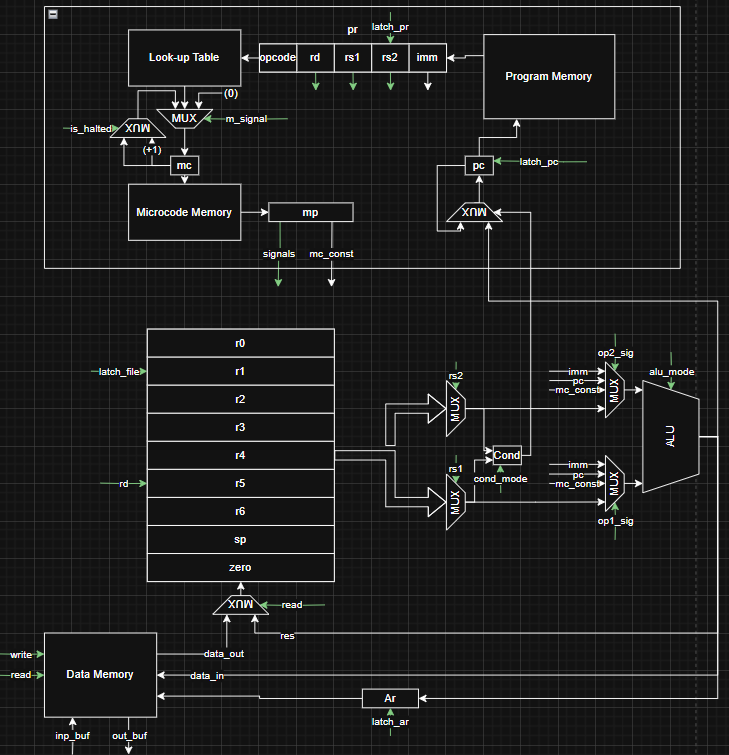

# Рисковая машинка)
- Трикашный Михаил Дмитриевич P3206
- Вариант: `asm | risc | harv | mc | tick | binary | stream | mem | cstr | prob1 | vector`
- Расшифровка:
  - `asm`: синтаксис ассемблера. Необходима поддержка `label`-ов, секций и директивы `.org`. Поддержка пользовательских макроопределений. 
  - `risc`: система команд должна быть упрощенной, в духе RISC архитектур
    -  Стандартизированная длина команд.
    -  Операции над данными осуществляются только в рамках регистров.
    -  Доступ к памяти и ввод-вывод -- отдельные операции
  - `harv`: Гарвардская архитектура
  - `mc`: команды реализованы с помощью микрокоманд
  - `tick`: процессор необходимо моделировать с точностью до такта, процесс моделирования может быть приостановлен на любом такте.
  - `binary`: бинарное представление машинного кода
  - `stream`: Ввод-вывод осуществляется как поток токенов.
  - `mem`: порты ввода-вывода отображаются в память и доступ к ним осуществляется штатными командами
  - `cstr`: Null-terminated (C string)
  - `prob1`: Euler problem 4 [link](https://projecteuler.net/problem=4)
  - `vector`: векторная организация процессора (понятие не имею что бы это значило)

# Язык программирования `asm`

```text
<программа> ::= { <директива> | <метка> | <инструкция> | <макрос> | <комментарий> }

<директива> ::= "." <идентификатор> [ <аргумент> ]
<идентификатор> ::= буква { буква | цифра | "_" }
<аргумент> ::= число | строка | метка

<метка> ::= <идентификатор> ":"
<инструкция> ::= <опкод> [ <операнд> { "," <операнд> } ]
<опкод> ::= "lui" | "mv" | "sw" | "lw" | ... (см. список инструкций)
<операнд> ::= <регистр> | <число> | <метка> | <макроподстановка>
<регистр> ::= "zero" | "r0" | ... | "r6" | "sp"
<число> ::= ["-"] цифра { цифра } | "0x" шестнадцатеричная_цифра { шестнадцатеричная_цифра } | "0b" двоичная_цифра { двоичная_цифра }
<макроподстановка> ::= "%hi(" <метка> ")" | "%lo(" <метка> ")"

<макрос> ::= ".macro" <идентификатор> <тело_макроса>
<комментарий> ::= ";" { любой_символ_кроме_перевода_строки }
```
- Стратегия вычислений:
  - Линейное выполнение инструкций в порядке их расположения в секции .text.
  - Поток управления изменяется инструкциями ветвления (j, jal, jr, bgt и др.). Адреса переходов вычисляются относительно текущего PC.
  - Данные обрабатываются только в регистрах. Доступ к памяти — через lw/sw.
  - Микрокоманды выполняются за 1 такт, но их внутренняя работа невидима на уровне ассемблера.

- Области видимости:
  - Метки видны во всей программе. Их значения определяются в момент ассемблирования.
  - Макросы (.macro) подставляются текстуально до парсинга инструкций.
  - Секции (.text, .data) изолированы: метки в .text не пересекаются с .data.

- Типизация и литералы:
  - Типы данных:
    - 32-битные целые числа (знаковые/беззнаковые).
  - Литералы:
    - Десятичные: 42, -10.
    - Шестнадцатеричные: 0x1A, 0xFFFF.
    - Двоичные: 0b1010.
    - Адреса меток: loop (подставляется как число).
    - Макросы: %hi(label) (старшие 16 бит), %lo(label) (младшие 16 бит).

- Особенности:
  - Метки в коде инструкций подставляются как (`значение метки` - `актуальный адрес` - 4)
  - Метки в коде данных подставляются как `значение метки`
  - Директива `.org` может использоваться в секции данных, в секции текста она игнорируется.
  - Метки могут располагаться как на одной строчке с инструкцией, так и инструкция может быть "под ней"
  - Первая инструкция для выполнения должна располагаться под меткой `_start`
  - Для секции данных есть директивы `.word` и `.byte`. При использовании `.byte` каждый из аргументов будет записываться по одному байту, при `.word` каждый из аргументов записывается как 4 байта. 

# Организация памяти
  - Гарвардская архитектура.
  - Размер машинного слова:
    - в памяти данных 32 бита
    - в памяти инструкций 32 бита
  - Линейное адресное пространство
  - Для работы с памятью данных используются команды `sw` и `lw` (используется как прямая, так и относительная адресации)
  - Для переходов в памяти инструкций (кроме `jr`, там используется прямая адресация) используется относительная адресация (относительно `pc`)
```text
       Program memory
+------------------------------+
| 00 : jump n                  |
|   ...                        |
|  n : _start: instruction1    |
|   ...                        |
+------------------------------+

          Data memory
+------------------------------+
| 00  : data                   |
|    ...                       |
|  n  : data                   |
|    ...                       |
+------------------------------+

```
# Набор инструкций

Размер инструкции: 4 байта.

- **Load Upper Immediate**
    - **Синтаксис:** `lui <rd>, <k>`
    - **Описание:** Загружает прямое значение сдвинутое влево на 16 бит в регистр.
    - **Операция:** `rd <- k << 16`

- **Move**
    - **Синтаксис:** `mv <rd>, <rs>`
    - **Описание:** Копирует значение из одного регистра в другой
    - **Операция:** `rd <- rs`

- **Store Word**
    - **Синтаксис:** `sw <rs2>, <offset>(<rs1>)`
    - **Описание:** Сохраняет 4х байтовое слово по адресу + сдвигу
    - **Операция:** `M[offset + rs1] <- rs2`

- **Load Word**
    - **Синтаксис:** `lw <rd>, <offset>(<rs1>)`
    - **Описание:** Загружает слово из памяти по адресу + сдвиг в регистр
    - **Операция:** `rd <- M[offset + rs1]`

- **Add Immediate**
    - **Синтаксис:** `addi <rd>, <rs1>, <k>`
    - **Описание:** Прибавляет 16 бит расширяя до знакового.
    - **Операция:** `rd <- rs1 + k`

- **Add**
    - **Синтаксис:** `add <rd>, <rs1>, <rs2>`
    - **Описание:** Складывает два числа
    - **Операция:** `rd <- rs1 + rs2`

- **Subtract**
    - **Синтаксис:** `sub <rd>, <rs1>, <rs2>`
    - **Описание:** Вычитает два числа
    - **Операция:** `rd <- rs1 - rs2`

- **Multiply**
    - **Синтаксис:** `mul <rd>, <rs1>, <rs2>`
    - **Описание:** Перемножает два числа и сохраняет младшие 32 бита результата
    - **Операция:** `rd <- rs1 * rs2`

- **Multiply High**
    - **Синтаксис:** `mulh <rd>, <rs1>, <rs2>`
    - **Описание:** Перемножает два числа и сохраняет старшие 32 бита результата
    - **Операция:** `rd <- (rs1 * rs2) >> 32`

- **Divide**
    - **Синтаксис:** `div <rd>, <rs1>, <rs2>`
    - **Описание:** Делит два числа
    - **Операция:** `rd <- rs1 / rs2`

- **Remainder**
    - **Синтаксис:** `rem <rd>, <rs1>, <rs2>`
    - **Описание:** Сохраняет остаток от деления двух чисел
    - **Операция:** `rd <- rs1 % rs2`

- **Logical Shift Left**
    - **Синтаксис:** `sll <rd>, <rs1>, <rs2>`
    - **Описание:** Логически сдвигает влево
    - **Операция:** `rd <- rs1 << rs2`

- **Logical Shift Right**
    - **Синтаксис:** `srl <rd>, <rs1>, <rs2>`
    - **Описание:** Логически сдвигает вправо
    - **Операция:** `rd <- rs1 >> rs2`

- **Arithmetic Shift Right**
    - **Синтаксис:** `sra <rd>, <rs1>, <rs2>`
    - **Описание:** Логически сдвигает вправо
    - **Операция:** `rd <- rs1 >> rs2`

- **Bitwise AND**
    - **Синтаксис:** `and <rd>, <rs1>, <rs2>`
    - **Описание:** Применяет логическое И для каждого бита обоих чисел
    - **Операция:** `rd <- rs1 & rs2`

- **Bitwise OR**
    - **Синтаксис:** `or <rd>, <rs1>, <rs2>`
    - **Описание:** Применяет логическое ИЛИ для каждого бита обоих чисел
    - **Операция:** `rd <- rs1 | rs2`

- **Bitwise XOR**
    - **Синтаксис:** `xor <rd>, <rs1>, <rs2>`
    - **Описание:** Применяет логическое ИСКЛ-ИЛИ для каждого бита обоих чисел
    - **Операция:** `rd <- rs1 ^ rs2`

- **Jump**
    - **Синтаксис:** `j <k>`
    - **Описание:** Переход к вычисленному значению `pc + k` 
    - **Операция:** `pc <- pc + k`

- **Jump and Link**
    - **Синтаксис:** `jal <rd>, <k>`
    - **Описание:** Записывает pc + 4 в регистр после чего действует аналогично `j`
    - **Операция:** `rd <- pc + 4, pc <- pc + k`

- **Jump Register**
    - **Синтаксис:** `jr <rs>`
    - **Описание:** Записывает в `pc` значение из регистра.
    - **Операция:** `pc <- rs`

- **Branch if Greater Than**
    - **Синтаксис:** `bgt <rs1>, <rs2>, <k>`
    - **Описание:** Перейти если больше
    - **Операция:** `if rs1 > rs2 then pc <- pc + k`

- **Branch if Greater Than (unsigned)**
    - **Синтаксис:** `bgtu <rs1>, <rs2>, <k>`
    - **Описание:** Перейти если больше или равно
    - **Операция:** `if rs1 > rs2 then pc <- pc + k`

- **Branch if Less Than or Equal**
    - **Синтаксис:** `ble <rs1>, <rs2>, <k>`
    - **Описание:** Перейти если меньше или равно
    - **Операция:** `if rs1 <= rs2 then pc <- pc + k`

- **Branch if Less Than or Equal (unsigned)**
    - **Синтаксис:** `bleu <rs1>, <rs2>, <k>`
    - **Описание:** Перейти если меньше
    - **Операция:** `if rs1 <= rs2 then pc <- pc + k`

- **Branch if Equal**
    - **Синтаксис:** `beq <rs1>, <rs2>, <k>`
    - **Описание:** переход если равно
    - **Операция:** `if rs1 == rs2 then pc <- pc + k`

- **Branch if Not Equal**
    - **Синтаксис:** `bne <rs1>, <rs2>, <k>`
    - **Описание:** Переход если не равно
    - **Операция:** `if rs1 != rs2 then pc <- pc + k`

- **Halt**
    - **Синтаксис:** `halt`
    - **Описание:** Останавливает машину

# Кодирование инструкций
```text
┌─────────┬───────┬─────────┬─────────┬───────────────────────────────┐
│ 31...27 │26...24│ 23...20 │ 19...16 │ 15                          0 │
├─────────┼───────┼─────────┼─────────┼───────────────────────────────┤
│ opcode  │  rd   │   rs1   │   rs2   │          imm value            │
└─────────┴───────┴─────────┴─────────┴───────────────────────────────┘
```
Опкоды операций:
- `00000` (0x00) - `lui`
- `00001` (0x01) - `mv`
- `00010` (0x02) - `sw`
- `00011` (0x03) - `lw`
- `00100` (0x04) - `addi`
- `00101` (0x05) - `add`
- `00110` (0x06) - `sub`
- `00111` (0x07) - `mul`
- `01000` (0x08) - `mulh`
- `01001` (0x09) - `div`
- `01010` (0x0a) - `rem`
- `01011` (0x0b) - `sll`
- `01100` (0x0c) - `srl`
- `01101` (0x0d) - `and`
- `01110` (0x0e) - `or`
- `01111` (0x0f) - `xor`
- `10000` (0x10) - `j`
- `10001` (0x11) - `jal`
- `10010` (0x12) - `jr`
- `10011` (0x13) - `ble`
- `10100` (0x14) - `bleu`
- `10101` (0x15) - `bgt`
- `10110` (0x16) - `bgtu`
- `10111` (0x17) - `beq`
- `11000` (0x18) - `bne`
- `11001` (0x19) - `halt`
- `11010` (0x1A) - `sra`

Коды регистров:
- `0000` (0x0) - `sp`
- `0001` (0x1) - `r0`
- `0010` (0x2) - `r1`
- `0011` (0x3) - `r2`
- `0100` (0x4) - `r3`
- `0101` (0x5) - `r4`
- `0110` (0x6) - `r5`
- `0111` (0x7) - `r6`
- `1000` (0x8) - `zero`

# Регистры
Доступные программисту:
`Zero` `r0` `r1` `r2` `r3` `r4` `r5` `r6` `Sp`
Недоступные программисту: `Ar` `Pc` `Mc` `Mr` `Pr`
- `Zero` - 32х битный регистр, всегда возвращает 0, read-only
- `r0` - `r6` - 32х битные регистры общего назначения
- `Sp` - 32х битный регистр общего назначения, но по лору это stack pointer
- `Ar` - регистр, хранящий в себе адрес памяти данных
- `Pc` - регистр, хранящий в себе адрес памяти инструкций
- `Mc` - регистр, хранящий в себе адрес памяти микрокоманд
- `Mr` - регистр, хранящий в себе микрокоманду, по адресу в `Mc`
- `Pr` - регистр, хранящий в себе инструкцию для выполнения

# АЛУ
Поговорим об АЛУ. В моей модели оно довольно "жирненькое". Режимы АЛУ:
- `0000`: `Сложение` - складывает два числа с шины первого аргумента и второго аргумента и выводит результат на шину результата.
- `0001`: `Вычитание` - вычитает число с шины второго аргумента из числа с шины первого аргумента и выводит результат на шину результата.
- `0010`: `Умножение (младшие 4 байте)` - перемножает числа с шин аргументов и выводит младшие 4 байта на шину результата.
- `0011`: `Умножение (старшие 4 байта)` - перемножает числа и выводит старшие 4 байта
- `0100`: `Деление` - целочисленно делит два числа
- `0101`: `Остаток от деления` - выводит на шину результата остаток от деления.
- `0110`: `Логический сдвиг влево` - побитого сдвигает первый аргумент влево
- `0111`: `Логический сдвиг вправо` - побитого сдвигает первый аргумент на второй аргумент вправо
- `1000`: `Побитовое AND` - побитого применяет конъюнкцию.
- `1001`: `Побитовое OR` - побитого применяет дизъюнкцию
- `1010`: `Побитовок XOR` - применяет побитого ИСКЛ-ИЛИ
- `1011`: `Арифметический сдвиг вправо` - сдвигает вправо с учетом знака

# Модуль условий
В моей модели для переходов используется отдельный модуль условий. Ему на вход подается режим работы и два аргумента. На выходе один бит выполнения условия (0 если не выполняется, 1 если выполняется). Режимы работы:
- `0000`: `Равенство` - возвращает 1 если два числа равны, 0 в противном случае
- `0001`: `Неравенство` - возвращает 1 если два числа неравны, 0 в противном случае
- `0010`: `Меньше или равно` - возвращает 1 если A <= B, 0 иначе.
- `0011`: `Меньше или равно (unsigned)` - возвращает 1 если A <= B, 0 иначе
- `0100`: `Больше` - возвращает 1 если A > B, 0 иначе
- `0101`: `Больше (unsigned)` - возвращает 1 если A > B, 0 иначе
- `0110`: `Всегда истина` - возвращает 1 всегда
- `0111`: `Всегда ложь` - возвращает 0 всегда

# Модуль памяти данных
Так как IO реализуется через MMIO, для его реализации написан отдельный модуль обращений к памяти данных

# Микрокоманды
Одна микрокоманда состоит из 25 бит (20 бит под сигналы и 5 бит под mc_const)
- 24ый бит: `is_halted` - если 1 машина останавливается
- [23:22] биты: `m_signal` - управляет мультиплексором на входе `mc`.
  - `00` - выбирает `mc + 1` или `mc` (зависит от `is_halted`)
  - `01` - выбирает значение из LUT
  - `10` - выбирает `0` (используется для начала обработки следующей инструкции)
- 21ой бит: `latch_pr` - защелкивает `pr`
- 20ый бит: `latch_pc` - защелкивает `pc` 
- 19ый бит: `latch_file` - при его активации защелкивается значение с мультиплексора файла на входе в регистр `rd`
- 18ый бит: `latch_ar` - защелкивает `ar`
- 17ый бит: `write` - при активации записывает в Data Memory по адресу в `ar` данные с входной шины
- 16ый бит: `read` - при активации считывает данные из Data Memory по адресу в `ar`
- [15:14] биты: `op1_sig` - управляет выбором первого операнда для АЛУ
  - `00` - выбирает один из регистров
  - `01` - выбирает `mc_const`
  - `10` - выбирает `pc`
  - `11` - выбирает `imm`
- [13:12] биты: `op2_sig` - управляет выбором второго операнда для АЛУ
  - `00` - выбирает один из регистров
  - `01` - выбирает `mc_const`
  - `10` - выбирает `pc`
  - `11` - выбирает `imm`
- [11:9] биты: `cond_mode` - управляет режимом работы Cond Module (см документацию)
- [8:5] биты: `alu_mode` - управляет режимом работы ALU (см документацию)
- [4:0] биты: `mc_const`

# Схема
